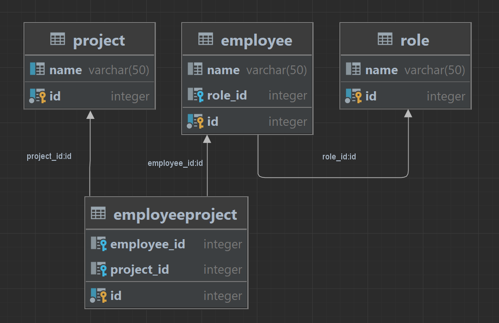

# <font color="orange">RESTJDBCServlet</font>
Проект по теме Servlet JDBC REST без SPRING

Задача:
1) Сделать REST сервис с использованием JDBC и Servlet
2) Функционал любой на выбор, минимум CRUD сервис с несколькими видами entity
3) Запрещено использовать Spring, Hibernate
4) Можно использовать Mapstruckt
5) Должны быть реализованы связи ManyToOne(OneToMany), ManyToMany
6) Связи должны быть отражены в коде
7) Сервлет должен возвращать DTO, не возвращаем Entity, принимать также DTO
8) Должны быть unit тесты, использовать Mockito и Junit
9) Для проверки работы репозитория(DAO) с БД использовать
    testcontainers: https://testcontainers.com/, https://habr.com/ru/articles/444982/
10) Покрытие тестами должно быть больше 80%
11) БД Postgres.  
12) Ставим плагин SonarLint.
***
# <font color="blue-green"> Запустить приложение:</font>
### <font color="green"> Вариант 1 (через tomcat 10.1.15 в IntelliJ IDEA) </font>
Примечание: в connection.properties должно быть
___connection.url=jdbc:postgresql://localhost:5432/postgres?currentSchema=task3___
1. Выполнить следующую команду:
``` 
mvn clean install
```

2. Запустить Docker.

3. Выполнить команду в терминале:

```shell
 docker run -p 5432:5432 --name postgres-db-Aston -e POSTGRES_USER=postgres -e POSTGRES_PASSWORD=123 -e POSTGRES_DB=postgres -e PGDATA=/var/lib/postgresql/data/pgdata -v d:\docker\aston:/var/lib/postgresql/data -d postgres:16.0
```
   
5. Инициализировать БД с помощью скрипта [data.sql](src/main/resources/sql/data.sql).

6. Запустить Postman;
7. Путь к ресурсу

    http://localhost:8080/

***
### <font color="green"> Вариант 2 (через docker-compose)</font>
Примечание: в connection.properties должно быть
___connection.url=jdbc:postgresql://postgres_aston:5432/postgres?currentSchema=task3___

1. Запустить Docker.

2. Выполнить следующие команды:
```
mvn clean install
```
```bash 
docker-compose up
```
```bash
docker-compose stop
```
```bash
docker-compose down
```

3. Запустить Postman;

4. Путь к ресурсу

    http://localhost:8080/AstonREST-1.0-SNAPSHOT/

# <font color="blue-green">Запросы в постмане:</font>
### <font color="green">Employee:</font>

GET http://localhost:8080/emp/all - получить всех работников

GET http://localhost:8080/emp/{id} - получить работника с {Id}

POST http://localhost:8080/emp - создать нового работника

    {
    "name": "Алексей Алексеев",
    "role": {
            "id": 4
            }     
    }

PUT http://localhost:8080/emp - изменить имя работника

    {
    "id": 10,
    "name": "Валентина Колобкова",
    "role": {
        "id": 4,
        "name": "Программист DB"
        } ,
    "projectList": []
    }

DELETE http://localhost:8080/emp/{id} - удалить работника с {Id}


### <font color="green">Role:</font>

GET http://localhost:8080/role/all - получить все роли

GET http://localhost:8080/role/{roleId} - получить роль с {roleId}

POST http://localhost:8080/role - создать новую роль

    {
    "name": "New role name"
    }

PUT http://localhost:8080/role - изменить роль

    {
    "id": 7,
    "name": "Engineer"
    }

DELETE http://localhost:8080/role/{roleId} - удалить роль с {roleId}


### <font color="green">Project:</font>

GET http://localhost:8080/project/all - получить все номера project

GET http://localhost:8080/project/{projectId} - получить project {projectId}

POST http://localhost:8080/project - сохранить в базу новый project
   
    {
    "name": "new Project"
    }

DELETE http://localhost:8080/project/{projectId} - удалить project {projectId}

PUT http://localhost:8080/project - изменить наименование project

    {
    "id": 6,
    "name": "Edit Project"
    }

DELETE http://localhost:8080/project/{projectId}/deleteEmployee/{employeeId} - удалить работника из проекта
* http://localhost:8080/project/4/deleteEmployee/12

PUT http://localhost:8080/project/{projectId}/addEmployee/{employeeId} - добавить работника в проект
* http://localhost:8080/project/5/addEmployee/13

# <font color="blue-green">Tests</font>
1. Запустить Docker
2. Выполнить команду:

* все
```shell
mvn test -Dgroups="DockerRequired, test"
```
    
* или только интеграционный тест с @Testcontainers
```shell
mvn test -Dgroups="DockerRequired"
``` 

# <font color="blue-green">DIAGRAMS</font>



